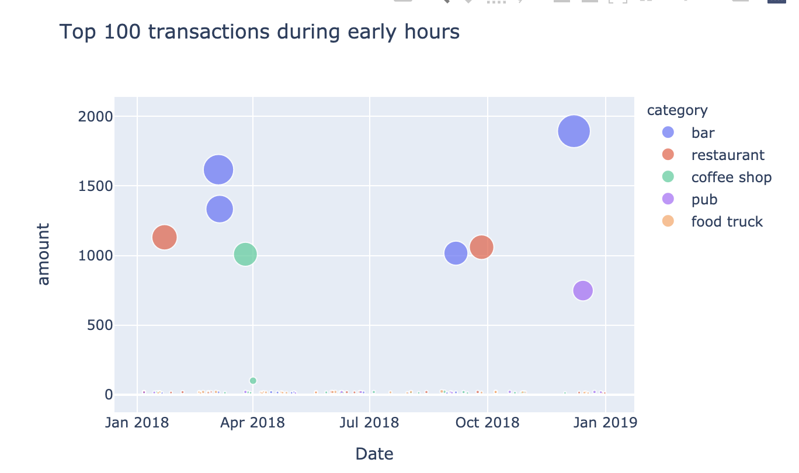
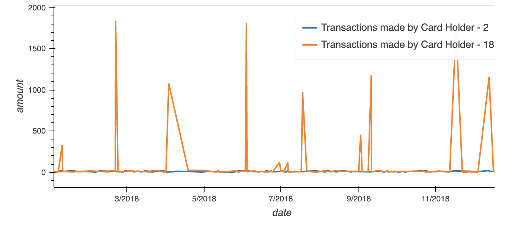

# Credit Card Fraud Analysis : Looking for Suspicious Transactions


*[Credit Card Fraudster by Richard Patterson](https://www.flickr.com/photos/136770128@N07/42252105582/) | [Creative Commons Licensed](https://creativecommons.org/licenses/by/2.0/)*

## Background

Fraud is everywhere these days—whether you are a small taco shop or a large international business. While there are emerging technologies that employ machine learning and artificial intelligence to detect fraud, many instances of fraud detection still require strong data analytics to find abnormal charges.

Analyze historical credit card transactions and consumption patterns in order to identify possible fraudulent transactions.


1. [Data Modeling](#Data-Modeling):
Define a database model to store the credit card transactions data and create a new PostgreSQL database using your model.

2. [Data Engineering](#Data-Engineering): Create a database schema on PostgreSQL and populate your database from the CSV files provided.

3. [Data Analysis](#Data-Analysis): Analyze the data to identify possible fraudulent transactions.

---

## Files

##### Query

* [schema.sql](Sql/schema.sql)
* [seed.sql](Sql/seed.sql)

##### Data
* [card_holder.csv](Data/card_holder.csv)
* [credit_card.csv](Data/credit_card.csv)
* [merchant_category.csv](Data/merchant_category.csv)
* [merchant.csv](Data/merchant.csv)
* [transaction.csv](Data/transaction.csv)

---

### Data Modeling

Entity relationship diagram (ERD) for storing the Transaction details.


### Data Engineering

Using your database model as a blueprint, created a database schema ([schema.sql](Sql/schema.sql)) for each of your tables and relationships such as specify data types, primary keys, foreign keys, and any other constraints necessary. 

Below are the contraints added to `credit_card` table.

```sql
ALTER TABLE "credit_card" ADD CONSTRAINT "fk_credit_card_id_card_holder" FOREIGN KEY("id_card_holder")
REFERENCES "card_holder" ("id");

ALTER TABLE "credit_card" ADD CONSTRAINT "check_credit_card_length"  CHECK (char_length("card") <= 20);

```

### Data Analysis

Now data is prepared within the database, it's finally time to identify fraudulent transactions using Pandas, Plotly Express, hvPlot, and SQLAlchemy to create the visualizations. 

Below are the some of the analysis:


1. Top 100 highest transactions during the time period 7:00 a.m. to 9:00 a.m.

    Below we see during early hours more money spend on Bar. There might be fraudulent transactions.

  


2. Created a report for any fraudulent transactions in the history of two of the most important customers of the firm. For privacy reasons, we only know that their cardholders' IDs are 18 and 2. Using hvPlot, created teh line plot representing transactions over the course of the year for both cardholder.

    

    * __Observations__ : `Both are suspectful because cardholder_2 made too many small trasactions and cardholder_18 made high amount anomaly trasaction`


3. The CEO of the firm's biggest customer suspects that someone has used her corporate credit card without authorization in the first quarter of 2018 to pay for several expensive restaurant bills. Find any anomalous transactions during that period.

  * Using Plotly Express, created a series of six box plots, one for each month, in order to identify how many outliers there are per month for cardholder ID 25.

  
  
  * __Observations__ : `We do see suspectful anomalies for cardholder_25 whose trasactions are highly spend on Bar, Pub, Resturant`


## Challenge

Another approach to identify fraudulent transactions is to look for outliers in the data. Standard deviation or quartiles are often used to detect outliers.

* #### Identifying Outliers using Standard Deviation

    

* #### Identifying Outliers using Interquartile Range

    
    
